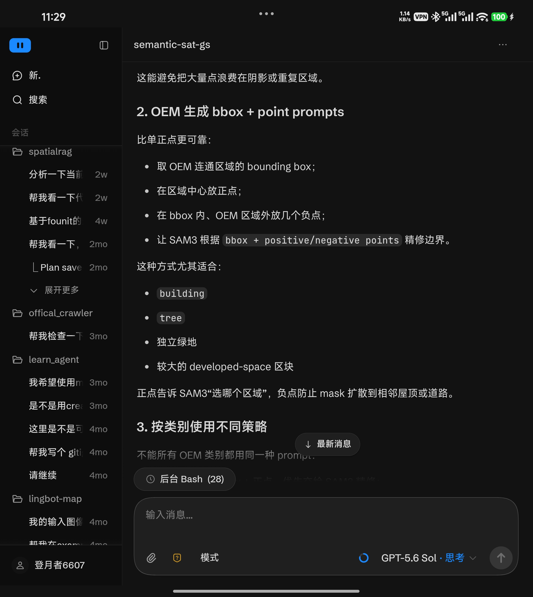
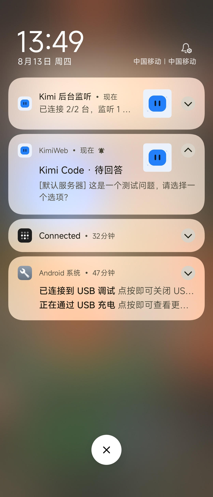
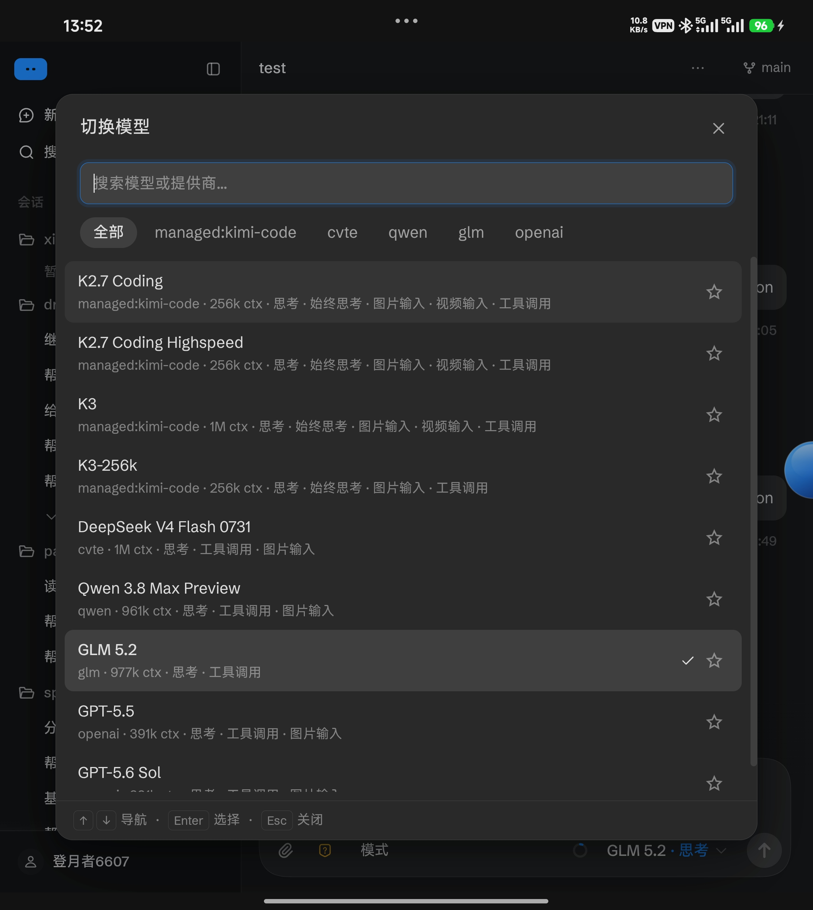
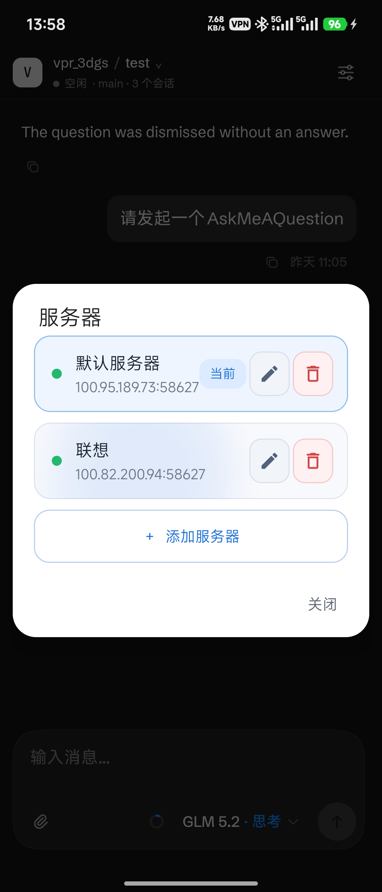
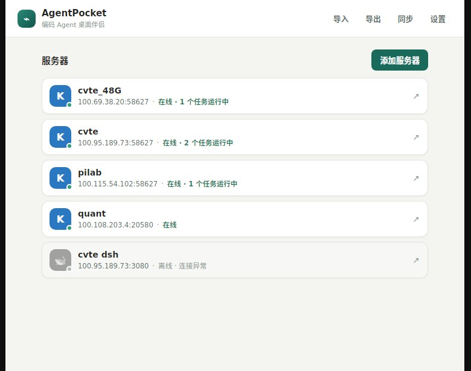

# AgentPocket

一个非官方 Android 客户端，通过 Tailscale 在手机上使用电脑中的编码 Agent Web 服务（Kimi Code、DeepSeek Harness 等），并在后台接收任务状态通知。

<p align="center">
  
  
</p>

<p align="center">
  
  
</p>

## 使用前提

1. 在电脑和 Android 手机上安装 [Tailscale](https://tailscale.com/download)，并登录同一个 Tailnet。
2. 在电脑上安装任一种编码 Agent 的 Web 服务：

   **Kimi Code**（macOS / Linux）：

   ```shell
   curl -fsSL https://code.kimi.com/kimi-code/install.sh | bash
   ```

   Windows PowerShell：

   ```powershell
   irm https://code.kimi.com/kimi-code/install.ps1 | iex
   ```

   **DeepSeek Harness**（需要 Node.js 18+）：

   ```shell
   npx -y @deepseek-ai/dsh web --trusted-host <Tailscale IP>
   ```

   国内网络可换镜像源：

   ```shell
   npx -y --registry=https://registry.npmmirror.com @deepseek-ai/dsh web --trusted-host <Tailscale IP>
   ```

3. 启动 Web 服务并允许网络访问。

   Kimi Code：

   ```shell
   kimi web --dangerous-bypass-auth --host 0.0.0.0 --port 58627
   ```

   此参数会关闭访问认证，请仅在可信的 Tailscale 网络中使用。

   DeepSeek Harness（dsh）只监听 `127.0.0.1`，手机访问需在电脑上做一次本地转发（socat）：

   ```shell
   socat TCP-LISTEN:3080,bind=<Tailscale IP>,reuseaddr,fork TCP:127.0.0.1:3080
   ```

   dsh 模型调用需要配置 API Key，二选一：

   - 启动前 `export DEEPSEEK_API_KEY=...`
   - 在电脑浏览器打开 `http://127.0.0.1:3080`，在 Models 页面写入凭据

4. 在 AgentPocket 中添加服务器并连接。

## 功能

- 在 Android 上使用 Kimi Code Web 与 DeepSeek Harness Web
- 管理多台服务器，后台监听任务状态，接收完成、待回答、审批和失败通知
- 扫码同步配置：手机与桌面端通过二维码互相同步服务器列表

## 使用

首次启动时添加服务器，填写电脑上 Web 服务的地址与端口：

- Kimi：`http://<Tailscale IP>:58627`
- dsh：`http://<Tailscale IP>:3080`

之后可通过屏幕侧边的悬浮入口切换或管理服务器；后台会同时监听所有已添加的服务器。

### 扫码同步配置

桌面端与手机端在同一 Tailscale 网络中时，可扫码互相同步服务器列表：

1. 在桌面端主界面点击头部「同步」按钮，弹出二维码。
2. 在手机端侧边悬浮球 → 服务器面板底部点击「扫码同步」，扫描该二维码。
3. 按需选择「获取电脑配置」（将电脑端服务器列表合并到手机）或「上传手机配置」（将手机端服务器列表发给电脑，电脑端会弹确认导入框）。

用系统相机或其他扫码工具扫描，也可直接拉起手机 App 进入同步。

### DeepSeek Harness 注意事项

- 手机端**不支持新建工作区**：请在电脑浏览器中创建，手机端可正常使用已有会话与工作区。

## Desktop（Linux）

<p align="center">
  
</p>

`desktop/` 提供轻量托盘控制中心。它可以同时监听多台 Kimi/dsh 服务器，在任务完成、失败或中断、等待审批、等待回答时发送系统通知；点击服务器即可在系统浏览器中打开（Kimi 自动携带登录态），有任务运行时点击状态行可展开运行中会话并直接跳转。关闭窗口后，监听仍在托盘中继续运行。

Releases 页面提供 Android APK 与 Linux 桌面端安装包（`.deb` / AppImage）。

### 开发与构建

需要 Node.js 22、Rust stable，以及 Tauri 在 Linux 上所需的 WebKitGTK、AppIndicator、OpenSSL 和构建工具。Ubuntu 22.04 可安装：

```shell
sudo apt install libwebkit2gtk-4.1-dev build-essential curl wget file libxdo-dev libssl-dev libayatana-appindicator3-dev librsvg2-dev
```

安装依赖并启动开发版：

```shell
cd desktop
npm ci
npm run tauri dev
```

构建 AppImage 与 `.deb`：

```shell
npm run tauri build -- --bundles appimage,deb
```

产物分别位于：

- `desktop/src-tauri/target/release/bundle/appimage/`
- `desktop/src-tauri/target/release/bundle/deb/`

### 使用说明

- 在设置窗口中添加服务器时，主机地址只填写域名或 IP，不包含 `http://`、端口或路径。
- 可以导入完整桌面配置或 Android 导出的服务器 JSON；导出时可选择完整配置或 Android 兼容列表。
- 点击头部「同步」可生成二维码与手机端互传配置；多网卡时可在弹窗中选择 Tailscale 或局域网地址（手机需能访问所选地址），详见上文「扫码同步配置」。
- **导出文件包含服务器访问凭据，请勿公开分享。**
- 服务器监听地址、可信网络、端口转发和防火墙仍需由用户自行配置。
- Windows 与 macOS 尚未进行正式发布验证。

## 服务器端（mesh 守护进程）

在没有显示器的服务器上一键安装 AgentPocket 守护进程，让 Kimi Code 配置（`~/.kimi-code/config.toml`）在所有机器间流动：

```bash
curl -fsSL https://raw.githubusercontent.com/npu-chenlin/AgentPocket/main/scripts/install.sh | sudo bash
```

安装后自动启动并开机自启。常用命令（`agentpocket …`）：

| 命令 | 作用 |
|---|---|
| `agentpocket peers` | 发现 tailnet 内的 AgentPocket 节点 |
| `agentpocket pull <IP或MagicDNS名>` | 拉取远端 `~/.kimi-code/config.toml` 覆盖本地（`--dry-run` 预览，旧文件备份为 `.bak`） |
| `agentpocket push <IP或MagicDNS名>` | 把本机 `config.toml` 推送给某节点 |
| `agentpocket status` | 查看本机所配服务器的在线/版本/活跃会话 |
| `agentpocket update` | 手动检查更新；服务每 24 小时自动检查，若安装为非 root 服务，按提示执行 `sudo agentpocket update` 完成更新 |
| `sudo agentpocket uninstall` | 停止并移除服务与二进制（配置目录保留） |

（若以其他用户登录，用 sudo -u <服务用户> agentpocket …；配置与服务共用同一用户目录）

守护进程与桌面端共用 `~/.local/share/com.local.agentpocket.desktop/config.json`，同机安装互不冲突。

mesh 端点仅在你的 Tailscale 网络内可达（Tailscale 网段之外一律拒绝）；节点间无鉴权，信任边界即你的 tailnet。

## 说明

本项目是非官方客户端，与 Moonshot AI/Kimi、DeepSeek 官方无隶属关系。请仅在可信网络中使用。

## License

[MIT](LICENSE)
