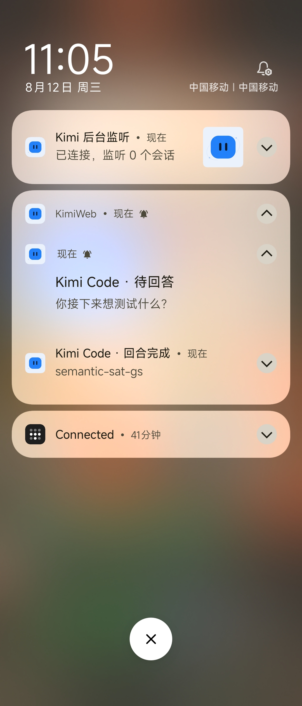

# KimiWeb

一个非官方 Android 客户端，通过 Tailscale 在手机上使用电脑中的 Kimi Code Web。

## 使用前提

1. 在电脑和 Android 手机上安装 Tailscale，并登录同一个 Tailnet。
2. 在电脑上启动 Kimi Code Web，并允许网络访问。
3. 将电脑的 Tailscale IP、端口和 token 填入 App。

例如：

```shell
kimi web --host 0.0.0.0 --port 58627
```

Kimi Code Web 通常会给出包含 token 的访问地址。可将完整地址直接粘贴进 App，例如：

```text
http://100.x.y.z:58627/#token=YOUR_TOKEN
```

其中 `100.x.y.z` 替换为电脑的 Tailscale IP。

## 功能

- 在手机上使用完整的 Kimi Code Web
- IP、端口和 token 只需配置一次
- 直接粘贴完整连接地址或启动信息即可自动识别
- 切换到后台后继续接收任务通知
- 支持回合完成、待回答、等待审批和失败通知
- 适配网页的亮色和暗色模式

## 通知效果

Kimi Code 回合完成或需要回答、审批时，通知会显示对应的会话和内容。



## 使用

首次启动时输入连接信息，或直接粘贴 Kimi Code Web 给出的完整地址。之后可从“Kimi 后台监听”通知中的“连接设置”修改。

## 说明

本项目是非官方客户端，与 Moonshot AI/Kimi 官方无隶属关系。请仅在可信网络中使用。

## License

[MIT](LICENSE)
